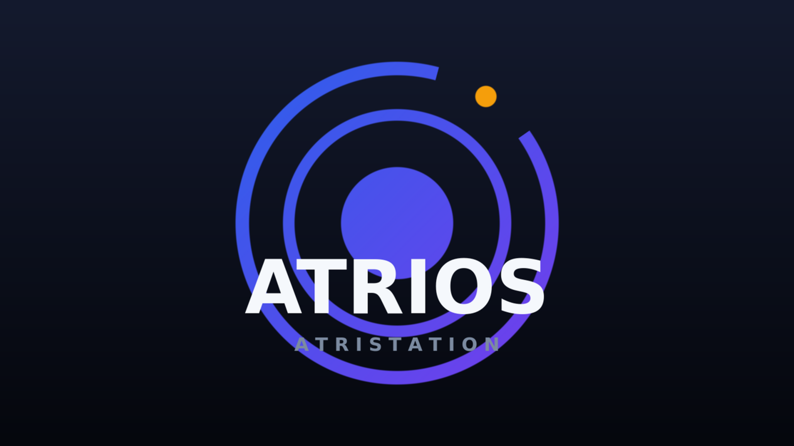

<p align="center">
  
</p>

<p align="center">
  <strong>Autonomous Embedded Linux Distribution for Smart Audio Hardware & Displays</strong>
  <br />
  <em>Complete local, cloud-free replacement firmware for <strong>Yandex Station Max / AtriStation</strong> (Amlogic S905X2 / S905X3 / SM1)</em>
</p>

<p align="center">
  
  
  
  
  
  
</p>

---

## Overview

**AtriOS** is an open-source, local-first Linux operating system engineered specifically for **Yandex Station Max (AtriStation)** hardware. It completely replaces the proprietary vendor Android software and cloud stack with a high-performance, open Debian/Ubuntu-based mainline Linux environment.

All hardware features — from the Gowin FPGA LED matrix display and dual IS31FL3236 LED ring to the 20V Silergy SY6045S Hi-Fi amplifiers, 4-channel microphone array, laser volume knob, Zigbee 3.0 NCP, and Realtek RTL8822CS dual-band wireless — operate **100% locally and offline** with zero telemetry or remote vendor lock-in.

---

## Hardware & Subsystem Status

| Subsystem | Hardware Component | Bus / Interface | Driver / Daemon | Status |
|---|---|---|---|---|
| **LED Matrix Display** | Gowin GW1N FPGA (25×16 LED matrix) | SPI (`spicc1`) + JTAG GPIO | `gowin_led_screen` / `atri-screen-test` | **Supported** |
| **LED Ring** | Dual IS31FL3236 (24 multicolor RGB zones) | I2C (`i2c0` @ `0x3c`, `0x3f`) | `leds-is31fl32xx` / `atrled` daemon | **Supported** |
| **Speaker Amplifiers** | Silergy SY6045S (PBTL Woofer + Stereo Tweeters) | I2C (`i2c2` @ `0x2a`, `0x2b`) + TDM B | `snd-soc-sy6045s` + anti-pop sequencer | **Supported** |
| **Headphone DAC** | Everest ES8156 (3.5mm headphone out) | I2C (`i2c2` @ `0x08`) + TDM B | `snd-soc-es8156` (mainline ASoC) | **Supported** |
| **Microphone ADC** | Everest ES7210 4-channel ADC | I2C (`i2c2` @ `0x40`) + TDM B | `snd-soc-es7210` (acoustic echo ref) | **Supported** |
| **Digital Mic Array** | 4-channel PDM microphone array | Amlogic PDM controller | `dmic-codec` / `pdm` DAI link | **Supported** |
| **Wi-Fi** | Realtek RTL8822CS (802.11ac 2×2 Dual-Band) | SDIO (`sd_emmc_a`, SDR50 100MHz) | `rtw88_8822cs` + virtual eFuse loader | **Supported** |
| **Bluetooth** | Realtek RTL8822CS Bluetooth 5.0 (H5) | UART_A (`/dev/ttyAML1`, 3MBaud, RTS/CTS) | `hci_h5` / `btrtl` serdev (`hci0`) | **Supported** |
| **Volume Knob** | Laser quadrature rotary encoder | Polled GPIO input (`REL_DIAL`) | `gpio-keys-polled` / `atrivolume` | **Supported** |
| **Zigbee 3.0** | Tuya TZ9213-2782 / Silicon Labs EFR32 | UART_AO_B (`/dev/ttyAML2`) + GPIOs | `atri-zigbee` (Z2M / ZHA coordinator) | **Supported** |
| **Light Sensor** | Lite-On LTR-308ALS ambient light sensor | I2C (`i2c2` @ `0x53`) | `ltr308als01` / `atri-als` daemon | **Supported** |
| **GPU / Video** | ARM Mali-G31 MP2 + Amlogic VDEC | PCIe / System bus | Panfrost DRM + Meson VDEC (4K HW) | **Supported** |

---

## Built-in CLI Tooling & Daemons

AtriOS packages dedicated native tools and background services installed into `/usr/bin`:

### Hardware & Peripherals
- **`atrled` / `atrledctl`**: Daemon and CLI client for 24-zone RGB LED ring. Supports tweened animations, volume arcs, breathing, rainbow waves, and notifications.
- **`atrivolume`**: Volume control daemon tying laser rotary encoder events (`REL_DIAL`) to ALSA mixer levels with smooth LED ring arc feedback.
- **`atri-screen-test` / `quasar_led_*`**: Diagnostic test suite, text rendering, and animation player for the 25×16 Gowin FPGA LED screen.
- **`atri-hwprobe`**: Comprehensive hardware audit tool. Enumerate GPIO lines, consumers, I2C addresses, SPI chips, and active input events (`--watch-gpio` tracks unknown pins).
- **`atri-zigbee`**: Tuya/EFR32 module manager: hardware reset, bootloader activation, XMODEM-CRC coordinator firmware flashing, and raw passthrough mode.
- **`atri-als`**: Ambient light sensor service with automatic screen & ring brightness adaptation.

### Wireless & Diagnostic Suite
- **`atri-wifi-diag`** (alias **`atri-wireless`**): Native diagnostic utility for Realtek RTL8822CS Wi-Fi and Bluetooth.
  ```bash
  atri-wifi-diag --all            # Full diagnostic suite (Wi-Fi, eFuse, BT, Scan)
  atri-wifi-diag --wifi           # Wi-Fi SDIO bus, clock, and driver status
  atri-wifi-diag --bt             # Bluetooth UART_A serdev, HCI state, and inquiry
  atri-wifi-diag --scan           # Active Wi-Fi scan benchmark (latency, BSSID table)
  atri-wifi-diag --efuse          # Inspect eFuse calibration map (RTL_ID, RFE, Xtal)
  atri-wifi-diag --inject-efuse   # Generate and write calibrated virtual eFuse file
  atri-wifi-diag --json           # Machine-readable JSON output for automated testing
  ```

---

## Local Voice Biometrics & Neural Speaker Verification

Located in `packages/atri-led/tools/`:
- **`voice_biometrics_gui.py`**: Interactive PyQt5 calibration GUI for recording owner voice profiles, testing speaker identification, and tuning noise thresholds.
- **`realtime_voice_listener.py`**: Background real-time audio listener matching incoming speech against `owner_profile.json` using TFLite neural embeddings (`models/head.tflite`, `models/body.tflite`).
- **Anti-Spoofing & Artifact Rejection**: Built-in harmonic and spectral filters protecting against synthetic artifacts, hand-clapping/pops, coughing, and non-owner interference.

```bash
# Launch calibration GUI
python3 packages/atri-led/tools/voice_biometrics_gui.py

# Start background speaker authentication listener
python3 packages/atri-led/tools/realtime_voice_listener.py
```

---

## Building AtriOS

AtriOS uses an optimized, reproducible build framework based on Armbian:

```bash
# Clone the repository
git clone https://github.com/leftymods/AtriOS.git
cd AtriOS

# Build minimal firmware image for AtriStation
./compile.sh build BOARD=atristation BRANCH=current BUILD_MINIMAL=yes
```

### Build Parameters
- `BOARD=atristation`: Target board configuration (`config/boards/atristation.conf`).
- `BRANCH=current`: Kernel version 6.18.y (`leftymods/linux-6.18.y`).
- `BUILD_MINIMAL=yes`: Clean, lightweight installation without unnecessary desktop bloat.

The compiled bootable image and Debian packages will be produced in `output/images/`.

---

## Documentation

- [`docs/atristation-bringup.md`](docs/atristation-bringup.md): Subsystem bring-up runbook and verification sequence.
- [`docs/atristation-hardware.md`](docs/atristation-hardware.md): Complete pinout map, power rail sequencing, and hardware specifications.
- [`docs/branding.md`](docs/branding.md): Official brand assets, design rules, and logo regeneration instructions.
- [`AGENTS.md`](AGENTS.md): Repository conventions, kernel patching architecture, and guidelines.

---

## License

AtriOS is licensed under the [GNU General Public License v2.0](LICENSE). Individual device drivers, kernel patches, and user utilities retain their respective upstream licenses.
